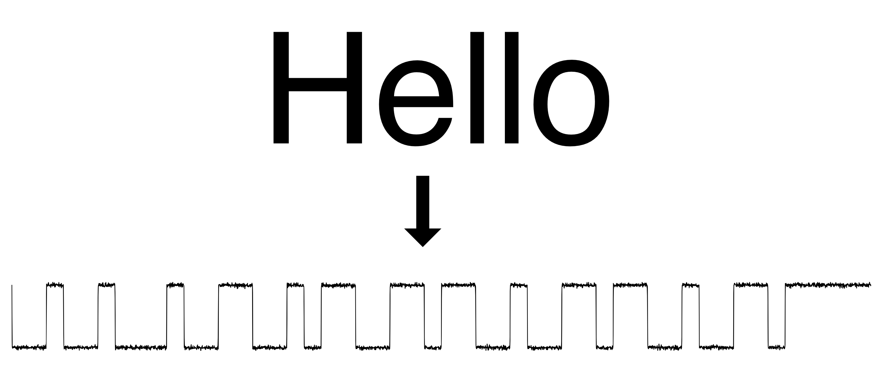

# Scopin' Sans
An open source typeface for hardware people!
It renders text as if it were being viewed as serial data on an oscilloscope.
There are currently 3 variations:
1. `Normal`
2. `FastBaud` - compressed horizontally
3. `NoNoise` - no baked-in noise, just square waves.

## Generating the typeface
1. Install [`fontforge`](https://fontforge.org/) on your computer. You will not need to use the GUI, but the installation of the app will provide the Python hooks used by this script.
2. Download/clone this repo, and navigate to it's root directory using a terminal.
3. Create a Python virtual environment: `python3 -m venv . `
4. Edit your new `pyvenv.cfg` file to allow the use of system-site packages (this will allow the script to access `fontforge`). Set `include-system-site-packages = true` and save the file.
5. Install dependencies: `pip install -r requirements.txt`
6. Run the script: `python main.py`
7. Two sets of `ttf` files will be generated, choose one set to install from:
   1. The set in `outputs/ScopinSans` are generated such that they are all a part of the same family. Each variation will be installed as a different _weight_. This keeps your system font list a little tidier, but certain applications may not let you choose font weights!
   2. The set in `outputs/ScopinSans-Individuals` are generated such that each variant is a unique font. They will all show up as individual fonts on your system.

## Using the typeface
Once the .ttf files are installed on your machine, you should be able to use Scopin' Sans like any other typeface.  *Note that only ascii values are generated currently!* There are 1-bit utility characters that can be used to generate arbitrary waveforms:
- `¥` - falling edge (0b10)
- `¦` - rising edge (0b01)
- [`§, ¨, ©, ª, «, ¬, ®, ¯`] - signal high (0b1) (there are multiple so you can randomize the noise)
- [`°, ±, ², ³, ´, ¶, ·, ¸`] - signal low (0b0) (there are multiple so you can randomize the noise)